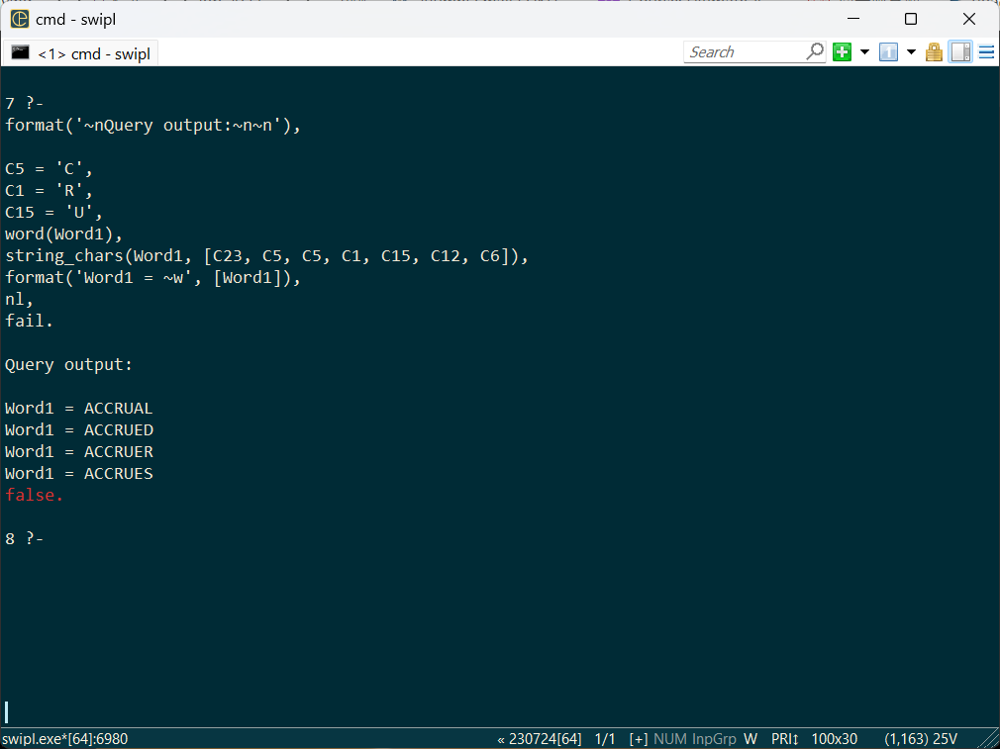

## Solving Codeword Puzzle through Prolog

<!--
Having started self-learning and using Prolog since 2016, I think I might be able to contribute a bit to Prolog by sharing some of my own use cases of the language.
-->

Recently I found a puzzle solving competition when randomly browsing in WH Smith. The compeition comes with cash prices and it attracted my attention. So I started pursuing in the hope to earn some extra money.

The compeition is to solve a codeword puzzle such as (but not exactly) below. Image is taken from [puzzler.com](https://www.puzzler.com/media/puzzles/samples/Codeword.pdf):

Contenders do not need to submit the whole completed puzzle. Rather, only a handful of characters are asked, such as charter 23, 11, 24, 20. Usually these would form a meaningful keyword of some sort such as "FISH".

And yes that's all one would get - Unlike what we usually see in crossword puzzles in newspaper, **there is no hint whatsoever**. According to [puzzler.com](https://www.puzzler.com/puzzles-a-z/codeword):

> A codeword is a completed crossword grid where each letter of the alphabet has been substituted for a number from 1-26. There will be at least one occurrence of each letter of the alphabet. Certain letters are given as starters. The solver must decipher the rest of the code to discover the words in the completed puzzle.

Below I would demonstrate how Prolog could be used to solve this puzzle, interactively, step by step. I avoid use of technical terms such as "instantiation" and "unification" to make it easier for readers without prior knowledge with Prolog.

# Dictionary

Obviously we need a library of English words before we can start asking Prolog to guess for us. For this I download English word dictionary from [words.txt](https://github.com/dwyl/english-words/blob/master/words.txt) from github project by [dwyl](https://github.com/dwyl/english-words). The text file is transformed into a Prolog source file by:

1. Capitalise every word e.g. Apple => APPLE
2. Filter out any word with non-alphabetical characters e.g. 10-POINT (not sure why these were included in the first place)
3. Transform word into Prolog fact e.g. APPLE => `word('APPLE')`.

The outcome is called `word.pl`. Content looks like:

~~~~
word('APPLE').
word('BANANA').
word('ORANGE').
word('PINEAPPLE').
word('STRAWBERRY').
~~~~

The real file has 416295 lines and could be found in this repository [here](../word.pl). To start having fun, run swi-prolog in console and load our dictionary file by entering command:

~~~~
swipl
consult('word.pl').
~~~~

Despite massive number of lines in `word.pl`, the file is loaded rather quickly, in just about 3 seconds.

Now we can start interrogating swi-prolog. But how should we start? As starting point we are given three known mappings: 5 => C, 1 => R, 15 => U. The word [23, 5, 5, 1, 15, 12, 6] should be a good start as it contains four instances of known letters [5, 5, 1, 15]:

Enter below query to see what Prolog can find from knowing merely three mappings:

~~~~
format('~nQuery output:~n~n'),

C5 = 'C',
C1 = 'R',
C15 = 'U',
word(Word1),
string_chars(Word1, [C23, C5, C5, C1, C15, C12, C6]),
format('Word1 = ~w', [Word1]), 
nl,
fail.
~~~~

Possible words denoted by [23, 5, 5, 1, 15, 12, 6] are surprisingly scarce - this might be an easy puzzle. From the output we can actually determine that character 23 maps to A. Character 12 and 16, however, could possibly map to [A, E] and [L, D, R, S] respectively. But let's not bother this for now and pretend [1, 5, 15] are the only knowns.

To progress further I label the word searched (w1 => `Word1` in code) and all known characters in the puzzle:

Picking the second word to inquire, [5, 26, 12, 12, 1, 20, 15, 22] looks like a good choice:

Because:

1. It has three instances of known characters
2. It contains character 12 which I believe has been determined in `Word1`

In Prolog, leveraging _known facts_ as heuristics is an important tactic for optimising search space (therefore, runtime). In word [5, 26, 12, 12, 1, 20, 15, 22], assuming character 12 is not determined, there are four unknown characters giving possible combinations of (26-4) x (26-5) x (26-6) x (26-7) = 175560. If we trust that character 12 has indeed been determined, there are only three unknowns leaving (26-4) x (26-5) x (26-6) = 9240 possible combinations.

If another word, for exmaple, [19, 23, 15, 22, 24, 21, 9, 8] is used, where there are seven unknown characters, there could be (26-4) x (26-5) x (26-6) x (26-7) x (26-8) x (26-9) x (26-10) = 859541760 possibilities. This would likely damage runtime very badly. Take this for granted for now without further elaboration.

So update query as below and run:

~~~~
format('~nQuery output:~n~n'),

C5 = 'C',
C1 = 'R',
C15 = 'U',

word(Word1),
string_chars(Word1, [C23, C5, C5, C1, C15, C12, C6]),
word(Word2),
string_chars(Word2, [C5, C26, C12, C12, C1, C20, C15, C22]),

format('Word1 = ~w', [Word1]), nl,
format('Word2 = ~w', [Word2]), nl,
nl,
fail.
~~~~

Prolog responds with:

~~~~
Query output:

Word1 = ACCRUED
Word2 = CHEERFUL

Word1 = ACCRUER
Word2 = CHEERFUL

Word1 = ACCRUES
Word2 = CHEERFUL
~~~~

Result looks promising in that `Word2` appears to be completely resolved.

We pick the next word to try by highlighting supposedly determined characters in the puzzle and look for the next plausible one. Having A (char 23) and E (char 12) resolved is really useful because they are most frequent among English words. Again we choose word that has relatively more known cracked characters:

[8, 21, 1, 23, 20, 20, 12] seems to be good choice because it has many known characters. Also char 21 and 23 are rather frequent in other unknown words.

Update query again and run:

~~~~
format('~nQuery output:~n~n'),

C5 = 'C',
C1 = 'R',
C15 = 'U',

word(Word1),
string_chars(Word1, [C23, C5, C5, C1, C15, C12, C6]),
word(Word2),
string_chars(Word2, [C5, C26, C12, C12, C1, C20, C15, C22]),
word(Word3),
string_chars(Word3, [C8, C21, C1, C23, C20, C20, C12]),

format('Word1 = ~w', [Word1]), nl,
format('Word2 = ~w', [Word2]), nl,
format('Word3 = ~w', [Word3]), nl,
nl,
fail.
~~~~

Prolog's respond:

~~~~
Query output:   

Word1 = ACCRUED 
Word2 = CHEERFUL
Word3 = AGRAFFE    <==

Word1 = ACCRUED 
Word2 = CHEERFUL
Word3 = GIRAFFE 

Word1 = ACCRUER 
Word2 = CHEERFUL
Word3 = AGRAFFE    <==

Word1 = ACCRUER 
Word2 = CHEERFUL
Word3 = GIRAFFE 

Word1 = ACCRUES 
Word2 = CHEERFUL
Word3 = AGRAFFE    <==

Word1 = ACCRUES 
Word2 = CHEERFUL
Word3 = GIRAFFE 

false.
~~~~

Something interesting about this output. Prolog suggests `Word3` could be `AGRAFFE`. Although Prolog has not been told, yet we know that this cannot be the case, because unknown characters are distinct. Char 8 and 23 cannot both map to `A` at the same time.

Despite this we know that char 8 might be `A` or `G` while char 21 might be `G` or `I`. Let's ask Prolog to search for words that have char 8, char 21 and char 23 in the hope to have them nailed. [8, 15, 21, 6, 23, 9, 5, 12] looks like the definite choice:

~~~~
format('~nQuery output:~n~n'),

C5 = 'C',
C1 = 'R',
C15 = 'U',

word(Word1),
string_chars(Word1, [C23, C5, C5, C1, C15, C12, C6]),
word(Word2),
string_chars(Word2, [C5, C26, C12, C12, C1, C20, C15, C22]),
word(Word3),
string_chars(Word3, [C8, C21, C1, C23, C20, C20, C12]),
word(Word4),
string_chars(Word4, [C8, C15, C21, C6, C23, C9, C5, C12]),

format('Word1 = ~w', [Word1]), nl,
format('Word2 = ~w', [Word2]), nl,
format('Word3 = ~w', [Word3]), nl,
format('Word4 = ~w', [Word4]), nl,
nl,
fail.
~~~~

In Prolog's respond we can see the uncertainties above are resolved since the output contains exactly one set of `Word[1-4]`:

~~~~
Query output:

Word1 = ACCRUED
Word2 = CHEERFUL
Word3 = GIRAFFE
Word4 = GUIDANCE

false.
~~~~

Furthermore char 6 and 9 are determined as `D` and `N` respectively. This time I am taking a greater leap by adding four more words in the query, introducing unknown characters 2, 3, 10 and 18:

~~~~
format('~nQuery output:~n~n'),

C5 = 'C',
C1 = 'R',
C15 = 'U',

word(Word1),
string_chars(Word1, [C23, C5, C5, C1, C15, C12, C6]),
word(Word2),
string_chars(Word2, [C5, C26, C12, C12, C1, C20, C15, C22]),
word(Word3),
string_chars(Word3, [C8, C21, C1, C23, C20, C20, C12]),
word(Word4),
string_chars(Word4, [C8, C15, C21, C6, C23, C9, C5, C12]),

word(Word5),
string_chars(Word5, [C18, C9, C12, C23, C6]),
word(Word6),
string_chars(Word6, [C12, C3, C15, C23, C22]),
word(Word7),
string_chars(Word7, [C1, C12, C10, C12, C6, C21, C12, C6]),
word(Word8),
string_chars(Word8, [C6, C21, C9, C8, C2]),

format('Word1 = ~w', [Word1]), nl,
format('Word2 = ~w', [Word2]), nl,
format('Word3 = ~w', [Word3]), nl,
format('Word4 = ~w', [Word4]), nl,
format('Word5 = ~w', [Word5]), nl,
format('Word6 = ~w', [Word6]), nl,
format('Word7 = ~w', [Word7]), nl,
format('Word8 = ~w', [Word8]), nl,
nl,
fail.
~~~~

~~~~
Query output:   
                
Word1 = ACCRUED 
Word2 = CHEERFUL
Word3 = GIRAFFE 
Word4 = GUIDANCE
Word5 = KNEAD   
Word6 = EQUAL   
Word7 = REMEDIED
Word8 = DINGE   
                
Word1 = ACCRUED 
Word2 = CHEERFUL
Word3 = GIRAFFE 
Word4 = GUIDANCE
Word5 = KNEAD   
Word6 = EQUAL   
Word7 = REMEDIED
Word8 = DINGY   
                
Word1 = ACCRUED 
Word2 = CHEERFUL
Word3 = GIRAFFE 
Word4 = GUIDANCE
Word5 = KNEAD   
Word6 = EQUAL   
Word7 = REMEDIED
Word8 = DINGO   
                
Word1 = ACCRUED 
Word2 = CHEERFUL
Word3 = GIRAFFE 
Word4 = GUIDANCE
Word5 = KNEAD   
Word6 = EQUAL   
Word7 = REMEDIED
Word8 = DINGS   
                
Word1 = ACCRUED 
Word2 = CHEERFUL
Word3 = GIRAFFE 
Word4 = GUIDANCE
Word5 = SNEAD   
Word6 = EQUAL   
Word7 = REMEDIED
Word8 = DINGE   
                
Word1 = ACCRUED 
Word2 = CHEERFUL
Word3 = GIRAFFE 
Word4 = GUIDANCE
Word5 = SNEAD   
Word6 = EQUAL   
Word7 = REMEDIED
Word8 = DINGY   
                
Word1 = ACCRUED 
Word2 = CHEERFUL
Word3 = GIRAFFE 
Word4 = GUIDANCE
Word5 = SNEAD   
Word6 = EQUAL   
Word7 = REMEDIED
Word8 = DINGO   
                
Word1 = ACCRUED 
Word2 = CHEERFUL
Word3 = GIRAFFE 
Word4 = GUIDANCE
Word5 = SNEAD   
Word6 = EQUAL   
Word7 = REMEDIED
Word8 = DINGS   
                
false.          
~~~~

Final version which generates exactly one set of solution:

~~~~
format('~nQuery output:~n~n'),

C5 = 'C',
C1 = 'R',
C15 = 'U',

word(Word1),
string_chars(Word1, [C23, C5, C5, C1, C15, C12, C6]),
word(Word2),
string_chars(Word2, [C5, C26, C12, C12, C1, C20, C15, C22]),
word(Word3),
string_chars(Word3, [C8, C21, C1, C23, C20, C20, C12]),
word(Word4),
string_chars(Word4, [C8, C15, C21, C6, C23, C9, C5, C12]),

word(Word5),
string_chars(Word5, [C18, C9, C12, C23, C6]),
word(Word6),
string_chars(Word6, [C12, C3, C15, C23, C22]),
word(Word7),
string_chars(Word7, [C1, C12, C10, C12, C6, C21, C12, C6]),
word(Word8),
string_chars(Word8, [C6, C21, C9, C8, C2]),

% I can see C2 and C18 both maps to 'E'. C18 was determined as 'E' so C2 cannot
C2 \= 'E',

word(Word9),
string_chars(Word9, [C20, C2, C22, C6]),
word(Word10),
string_chars(Word10, [C4, C23, C5, C18, C6, C23, C25]),
word(Word11),
string_chars(Word11, [C23, C5, C10, C12]),
word(Word12),
string_chars(Word12, [C23, C6, C23, C16, C24]),
word(Word13),
string_chars(Word13, [C20, C12, C9, C5, C12]),
word(Word14),
string_chars(Word14, [C4, C23, C14, C14]),

word(Word15),
string_chars(Word15, [C19, C23, C15, C22, C24, C21, C9, C8]),
word(Word16),
string_chars(Word16, [C9, C23, C16, C12]),

word(Word17),
string_chars(Word17, [C7, C22, C23, C6, C12]),
word(Word18),
string_chars(Word18, [C13, C11, C9, C2, C9, C11, C10]),
word(Word19),
string_chars(Word19, [C23, C8, C1, C12, C12]),

word(Word20),
string_chars(Word20, [C7, C1, C23, C21, C9]),
word(Word21),
string_chars(Word21, [C23, C5, C5, C12, C9, C24]),
word(Word22),
string_chars(Word22, [C19, C12, C17, C12, C6]),

word(Word23),
string_chars(Word23, [C16, C15, C14, C14, C22, C12, C6]),
word(Word24),
string_chars(Word24, [C23, C19, C23, C21, C22]),
word(Word25),
string_chars(Word25, [C5, C26, C12, C23, C16, C22, C11]),
word(Word26),
string_chars(Word26, [C13, C10, C15, C8, C22, C11]),

% These are retrospectively added after checking duplication output
C7 \= C8,
C5 \= C7,
C9 \= C17,
C6 \= C14,

format('C1  = ~w   C2  = ~w   C3  = ~w   C4  = ~w   C5  = ~w', [C1, C2, C3, C4, C5]), nl,
format('C6  = ~w   C7  = ~w   C8  = ~w   C9  = ~w   C10 = ~w', [C6, C7, C8, C9, C10]), nl,
format('C11 = ~w   C12 = ~w   C13 = ~w   C14 = ~w   C15 = ~w', [C11, C12, C13, C14, C15]), nl,
format('C16 = ~w   C17 = ~w   C18 = ~w   C19 = ~w   C20 = ~w', [C16, C17, C18, C19, C20]), nl,
format('C21 = ~w   C22 = ~w   C23 = ~w   C24 = ~w   C25 = ~w   C26 = ~w', [C21, C22, C23, C24, C25, C26]), nl, nl,

format('Word1  = ~w', [Word1]), nl,
format('Word2  = ~w', [Word2]), nl,
format('Word3  = ~w', [Word3]), nl,
format('Word4  = ~w', [Word4]), nl,
format('Word5  = ~w', [Word5]), nl,
format('Word6  = ~w', [Word6]), nl,
format('Word7  = ~w', [Word7]), nl,
format('Word8  = ~w', [Word8]), nl,
format('Word9  = ~w', [Word9]), nl,
format('Word10 = ~w', [Word10]), nl,
format('Word11 = ~w', [Word11]), nl,
format('Word12 = ~w', [Word12]), nl,
format('Word13 = ~w', [Word13]), nl,
format('Word14 = ~w', [Word14]), nl,
format('Word15 = ~w', [Word15]), nl,
format('Word16 = ~w', [Word16]), nl,
format('Word17 = ~w', [Word17]), nl,
format('Word18 = ~w', [Word18]), nl,
format('Word19 = ~w', [Word19]), nl,
format('Word20 = ~w', [Word20]), nl,
format('Word21 = ~w', [Word21]), nl,
format('Word22 = ~w', [Word22]), nl,
format('Word23 = ~w', [Word23]), nl,
format('Word24 = ~w', [Word24]), nl,
format('Word25 = ~w', [Word25]), nl,
format('Word26 = ~w', [Word26]), nl, nl,

format('Duplication:'), nl,
Solution = [C1, C2, C3, C4, C5, C6, C7, C8, C9, C10, C11, C12, C13, C14, C15, C16, C17, C18, C19, C20, C21, C22, C23, C24, C25, C26],
member(X, Solution),
member(Y, Solution),
nth1(Ind1, Solution, X),
nth1(Ind2, Solution, Y),
X = Y,
Ind1 \= Ind2,
format('X = ~w   Ind1 = ~w   Y = ~w   Ind2 = ~w', [X, Y, Ind1, Ind2]), nl,

nl,
fail.
~~~~
